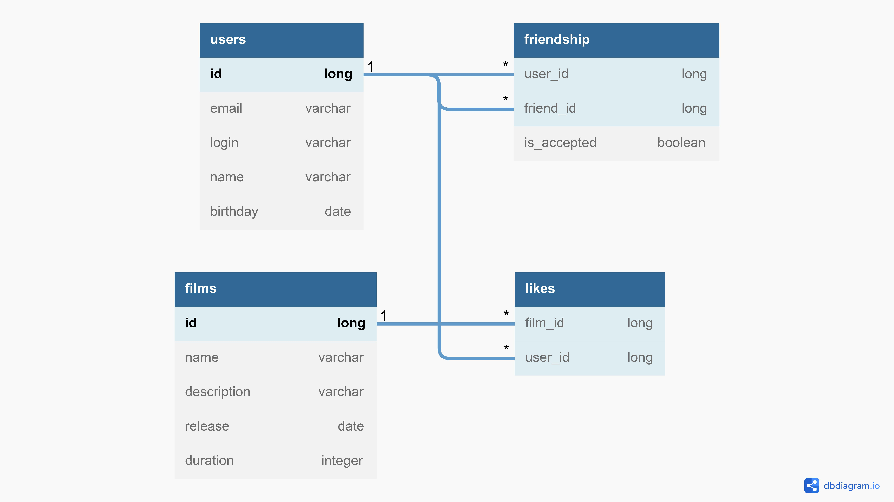

# java-filmorate
Educational project with using lombok and spring boot
_________________________
## Database scheme with relations

(Database structure)
_____________
## SQL business-logic examples using this architecture

[sql_examples link](sql_examples.sql)

```sql
--Get all users
select id, name from users

--Get all films
select id, name from films

--Get friends of the user id = <input>
Select
  U.id 
  U.name 
from users U
inner join friendship F 
  on U.id = F.user_id
  and F.is_accepted
  and U.id = <input>

--Get mutual friends with ids <input_1> and <input_2>
Select
  F1.friend_id,
  U.name
from friendship F1
inner join friendship F2
  on F1.friend_id = F2.friend_id
  and F1.user_id = <input_1>
  and F2.user_id = <input_2>
inner join users U
  on F1.friend_id = U.user_id

--Get top 10 popular films
with likes_cnt as (
	Select
	  F.name,
	  count(L.user_id) as cnt
	from likes L
	inner join films F
	  on F.id = L.film_id
	group by L.film_id  
	order by count(L.user_id) desc
)
select 
  row_number(l.cnt) over (partition by l.name order by l.cnt) as place,
  l.name,
  cnt as likes
from likes_cnt l
order by cnt desc
```